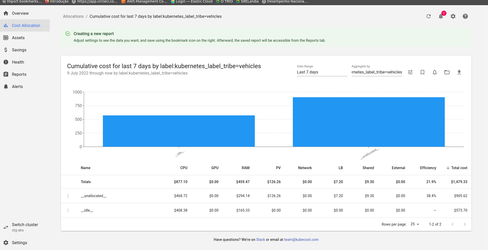
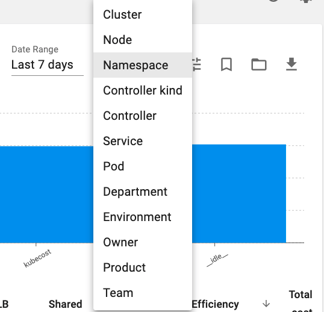

# Retorno de pesquisa por recurso retorna como `__unallocated__`

Referencia:
[Kubernetes Cost Allocation](https://guide.kubecost.com/hc/en-us/articles/4407601807383-Kubernetes-Cost-Allocation)

## Kubernetes Cost Allocation
A visualização Kubecost Allocation permite que você veja rapidamente os gastos alocados em todos os conceitos nativos do Kubernetes, por exemplo,namespace, k8s label e service. Também permite alocar custos a conceitos organizacionais como equipe (team), produto/projeto (product/project), departamento (department) ou ambiente (environment). Este documento explica as métricas apresentadas e descreve como você pode controlar os dados exibidos nesta visualização.

### **Discriminação** (Breakdown)

Custo agregado por namespace, deployment, service e outros conceitos nativos do Kubernetes.Agregações de custos também são visíveis por outros conceitos organizacionais significativos, por exemplo, Team, Department e Product. Essas agregações (aggregations) são baseadas em labels do Kubernetes, referenciados no nível do pod e do namespace, com labels no nível do pod sendo favorecidos em relação ao rótulo do namespace quando ambos estão presentes. O nome do label do Kubernetes usado para esses conceitos pode ser configurado em Settings ou em values.yaml após definir `kubecostProductConfigs.labelMappingConfigs.enabled` como `true`. As cargas de trabalho (Workloads) sem o rótulo relevante serão mostradas como __unallocated__.

> As anotações do Kubernetes também podem ser usadas para fins de alocação de custos, mas isso requer a ativação de uma helm flag. Saiba mais sobre como usar anotações.

Para descobrir quais pods não fazem parte do conjunto de labels relevante... você pode aplicar um filtro de label __unallocated__ nesta visualização de alocação ou explorar variações dos seguintes comandos kubectl:

### **Opções adicionais** (Additional Options)

**Custo ocioso** (Idle Cost)
A alocação de custos ociosos distribui proporcionalmente os custos de cluster ociosos ou de folga para os tenants. Especificamente, isso se aplica a recursos provisionados, mas que não estão sendo totalmente usados ​​ou solicitados por um tenant. Por exemplo, se seu cluster for utilizado apenas 25%, conforme medido pelo uso máximo de recursos e solicitações, a aplicação de custos ociosos aumentaria proporcionalmente o custo de cada pod/namespace/implantação em 4x. Esse recurso pode ser ativado por padrão em Settings.

**Gráfico** (Chart)
Visualize os dados de alocação nos seguintes formatos:
* Cost : Custo total por agregação no período;
* Cost over time: Custo por agregação dividido em dias ou horas, dependendo do intervalo de datas;
* Proportional Cost: Custo por agregado exibido como uma porcentagem do custo total no período

**Métricas de custo** (Cost metrics)
Visualize os custos cumulativos ou de taxa de execução medidos na janela de tempo selecionada com base nos recursos alocados.

* Cumulative Costs : representa o gasto real/histórico capturado pelo agente Kubecost na janela de tempo selecionada;
* Rate metrics : custo de "taxa de execução" por hora, diária ou mensal, também usado para valores de custo projetados, com base em amostras na janela de tempo selecionada.

As alocações de custos são baseadas no seguinte:
1. recursos alocados, ou seja, máximo de solicitações e uso de recursos
2. o custo de cada recurso
3. a quantidade de tempo que os recursos foram provisionados

Para obter mais informações, consulte este [FAQ](https://github.com/opencost/opencost#frequently-asked-questions) sobre como cada uma dessas entradas é determinada com base em seu ambiente.

**Filtro** (Filter)
Filtre recursos por namespace, clusterId e label do Kubernetes para investigar mais de perto um aumento nos gastos ou os principais fatores de custo em diferentes agregações, por exemplo, Deployments ou pods. Quando um filtro é aplicado, apenas os recursos com esse valor correspondente serão mostrados. Esses filtros também são aplicados a tags de recursos externos fora do cluster. Os filtros suportados são os seguintes:

* Namespace : Limita os resultados a workloads em um conjunto de namespaces.
* ClusterID : Limita os resultados a workloads em um conjunto de clusters com IDs correspondentes. Nota: clusterID é passado em valores no momento da instalação.
* Label : Limita os resultados a workloads com rótulos correspondentes do Kubernetes. Os rótulos de namespace são aplicados a todas as workloads. Suporta filtragem por campo __unallocated__ também

**Recursos compartilhados** (Shared Resources)
Selecione como os custos compartilhados definidos na página de configurações serão compartilhados entre as alocações

### Cost metrics (Métricas de custo)

As métricas de alocação de custos estão disponíveis para recursos dentro e fora do cluster. Aqui estão breves descrições de cada métrica:

* **Memory cost** : O custo total de memória alocado para este objeto, por exemplo. namespace ou deployment. A quantidade de memória alocada é maior entre o uso de memória e a memória solicitada na janela de tempo medida. O preço da memória alocada é baseado em APIs de cobrança na nuvem ou planilhas de preços personalizadas.

* **CPU Cost** :  O custo total de CPU alocado para este objeto, por exemplo, namespace ou deployment. A quantidade de CPU alocada é maior entre o uso da CPU e a CPU solicitada na janela de tempo medida. O preço da CPU alocada é baseado em APIs de cobrança na nuvem ou planilhas de preços personalizadas.

...

* **Shared Cost** : O custo dos recursos compartilhados alocados para este locatário. Este campo abrange sobrecarga compartilhada, namespaces compartilhados e rótulos compartilhados.

* **External Cost** : O custo de recursos fora do cluster alocados para este objeto. Por exemplo, buckets do S3 alocados para um deployment específica do Kubernetes. Os preços são baseados em dados de cobrança na nuvem e exigem uma chave. Esse recurso está atualmente disponível para AWS [(saiba mais)](https://guide.kubecost.com/hc/en-us/articles/4407596810519), GCP (saiba mais) e Azure [(saiba mais)](https://guide.kubecost.com/hc/en-us/articles/4407595936023).